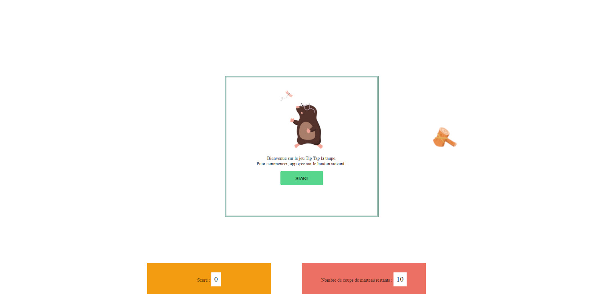
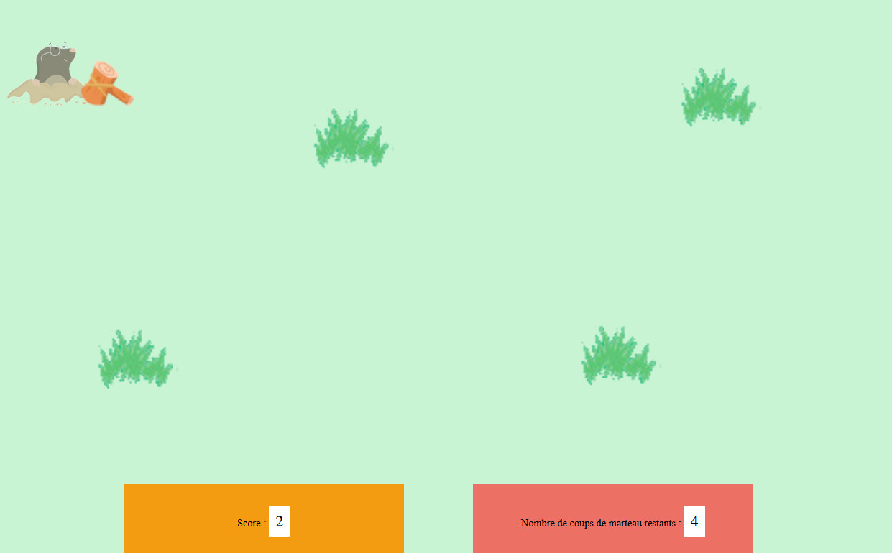

# Jeu de tir : TipTap  la Taupe

Projet réalisé mi-novembre 2023. 
<strong>Délai :</strong> environ 20 heures.

## Langages utilisés
- HTML
- CSS
- Javascript

## Contraintes

- les cibles apparaissent à des coordonnées aléatoires, de manière cyclique
- l'apparition et la disparition sont animées
- une cible ne doit pas être touchée deux fois
- le score est affiché et mis à jour en permanence
- à la fin, un message apparaît différent selon le score
- possibilité de démarrer une nouvelle partie

<h2 style="text-align: center;">Images du jeu de tir</h2>

<h4 style="text-align: center;">Accueil du jeu :</h4>

 

<h4 style="text-align: center;">Jeu en cours :</h4>

 